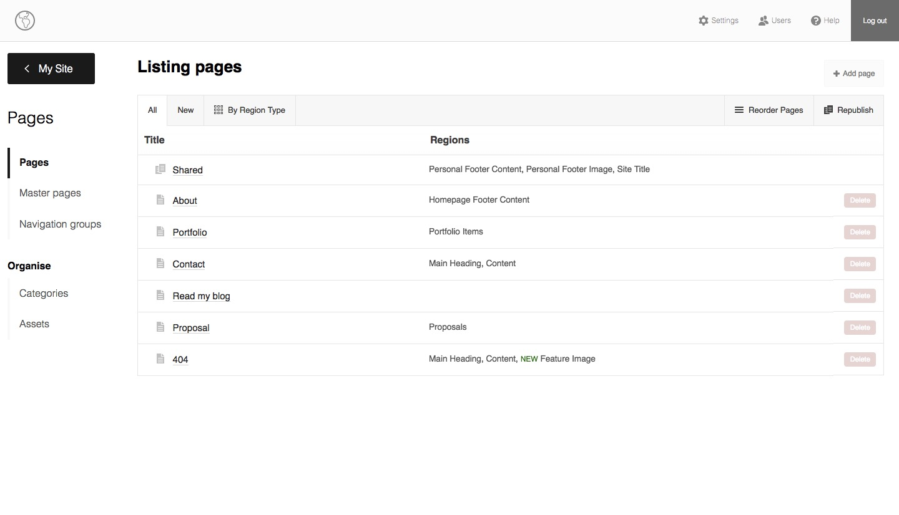
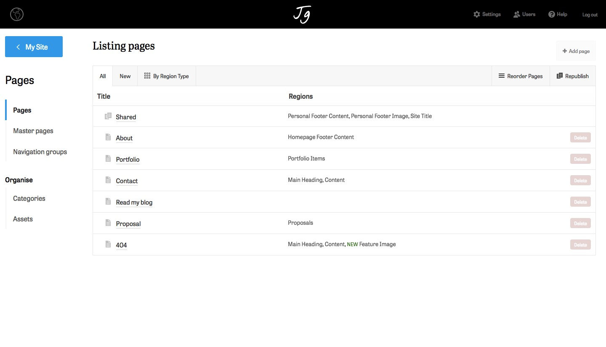

# Installation
- Drop the `jaygeorge_admin_style` folder into your `/perch/addons/apps` folder
- Log into Perch
- You should now see the app name in the left column of your Perch admin
- Go into the app in the admin and follow instructions

# About this App
This is a very simple App, which allows you to style the admin interface for different clients, with some base styling defaults.

To future proof as much as possible this app tries not to touch any layout; only padding and colouring adjustments. Do not change the values of any file in the plugin folder—instead use your new /perch/addons/plugins/ui/custom-admin.css to style the admin.

## Why not just follow the default [UI Customisation documentation](https://docs.grabaperch.com/api/custom-ui/)?
- The current default implementation does not allow you to add CSS to the `<head/>` when the admin loads. Instead, any modifications are loaded after the closing `<body/>` tag. This results in a "flicker" as the stylesheet is output after the body. While this may not be an issue for small CSS modifications, if you load even a moderate amount of CSS, traversing the admin quickly becomes distracting.
- The Perch API, which is available to Apps, allows us to add code directly to the `<head/>`. This means we can also add things like a favicon and load an external stylesheet e.g. Typekit or Google Fonts

### Speed
This App is carefully architected so you get good default styles, and branding for different clients is just a case of adding some CSS variables to the `custom-admin` starter CSS file.

Here is an example of the minimal amount of CSS you may need to add:

```
/* Redefine/override any CSS variables here */
body {
    /* GROUP VARIABLES -- COLOURS -- THEME
    =================================================== */
    --colour-main: #00a9eb;
    --colour-main-hover: #0084b7;
    --colour-perch-background: #fcfcfc;
    /* GROUP VARIABLES -- DECORATION -- TEXT
    =================================================== */
    --font-family-main: tablet-gothic, sans-serif;
    --font-family-headline: abril-titling, serif;
    /* GROUP VARIABLES -- DECORATION -- TEXT -- WEIGHTS
    =================================================== */
    --font-family-main-weight-normal: 400;
    --font-family-main-weight-strong: 600;
    --font-family-headline-strong: 400;
}

/* Add any brand specific CSS here */
/* GROUP MOLECULES / BARS / TOP / DECORATION
=================================================== */
.title-panel h1 {
    font-family: var(--font-family-headline);
    font-weight: var(--font-family-headline-strong);
}
```

Takes the default App style from this:


To this:
