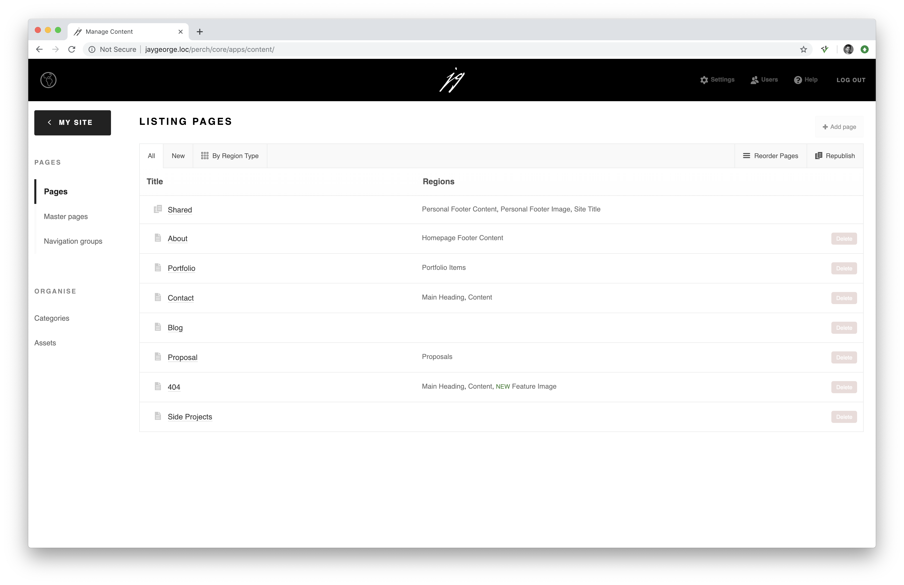
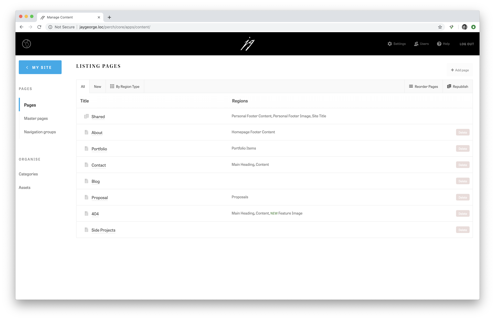
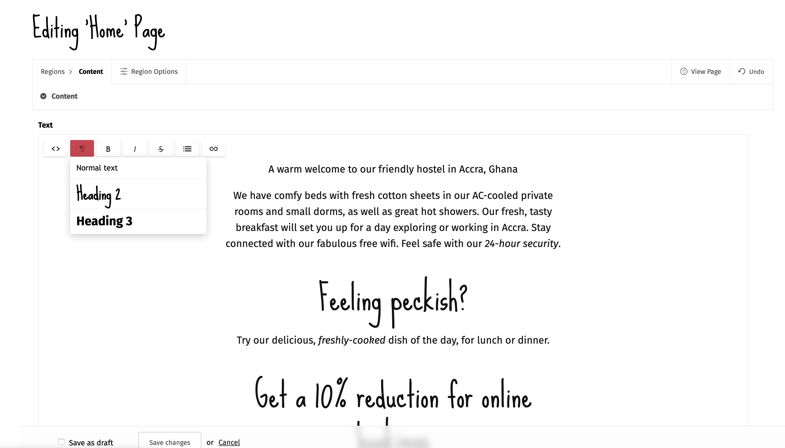

# Perch Admin Style

[Jump to installation instructions](#installation).

## About this App

This is a very simple App, which allows you to style the admin interface for different clients, with some base styling defaults.

To future proof as much as possible this app tries not to touch any layout; only padding and colouring adjustments. Do not change the values of any file in the plugin folder—instead use your new `/perch/addons/plugins/ui/custom-admin.css` to style the admin.

### Why wouldn't you just follow the default [UI Customisation documentation](https://docs.grabaperch.com/api/custom-ui/)?

- The current default implementation does not allow you to add CSS to the `<head/>` when the admin loads. Instead, any modifications are loaded after the closing `<body/>` tag. This results in a "flicker" as the stylesheet is output after the body. While this may not be an issue for small CSS modifications, if you load even a moderate amount of CSS, traversing the admin quickly becomes distracting.
- The Perch API, which is available to Apps, allows us to add code directly to the `<head/>`. This means we can also add things like a favicon and load an external stylesheet e.g. Typekit or Google Fonts

This App is carefully architected so you get good default styles, and branding for different clients is just a case of adding some CSS variables to the `custom-admin` starter CSS file.

Here is an example of the minimal amount of CSS you may need to add:

``` CSS
/* Redefine/override any CSS variables here */
body {
    /* GROUP VARIABLES -- COLOURS -- THEME
    =================================================== */
    --colour-main: #00a9eb;
    --colour-main-hover: #0084b7;
    /* GROUP ATOMS -- DECORATION -- TEXT
    =================================================== */
    --font-family-main: tablet-gothic, sans-serif;
    --font-family-headline: kepler-std-display, serif;
    /* GROUP ATOMS -- DECORATION -- TEXT -- WEIGHTS
    =================================================== */
    --font-family-main-weight-normal: 400;
    --font-family-main-weight-strong: 600;
    --font-family-headline-strong: 400;
}

/* Add any brand specific CSS here */
/* GROUP MOLECULES / BARS / TOP / DECORATION
=================================================== */
.title-panel h1 {
    font-family: var(--font-family-headline);
    font-weight: var(--font-family-headline-strong);
}

.sidebar-back .back {
    font-size: 0.8em;
    letter-spacing: 3px;
}
```

Takes the default App style from this:


To this:


### Extra Customisation

The app also contains:

- Login CSS which you can customise (see `/_config.inc` for instructions)
- Hints for styling the Redactor Editor (see `/extra/extra.css` for instructions)

Here is an example of a styled Redactor textarea:


#### Hiding the admin style link

If you'd like to hide the admin style link in the menu, I've included a CSS sample for you to uncomment at the top of `custom-admin.css`.

## Installation

- If you are downloading this app as a zip file from GitHub, rather than installing as a submodule, you should rename the downloaded folder from `jaygeorge_perch_admin_style-master` to `jaygeorge_perch_admin_style`
- Drop the `jaygeorge_perch_admin_style` folder into your `/perch/addons/apps` folder
- Log into Perch
- You should now see the app name in the left column of your Perch admin
- Go into the app in the admin and follow instructions

## Installing as a Git Submodule (optional but recommended)

To keep this app up to date easily I recommend you install it as a Git submodule to your project. You can then check for updates easily rather than re-downloading this project.

Here are some brief instructions:

- Make sure you're inside your main project directory
- Run the command `git submodule add https://github.com/JayGeorge/jaygeorge_perch_admin_style.git perch/addons/apps/jaygeorge_perch_admin_style`

This command will add the Admin Style app into the directory `perch/addons/apps/`

Run `git status`. You should notice a new `.gitmodules` file if this is the first time you've added a submodule to your repository. This is a configuration file that stores the mapping between the project’s URL and the local subdirectory you've pulled it into.

### Updating the app

- Make sure you're inside your main project directory
- Run the command `git submodule update --remote`. This will update all submodules, including this Perch Admin Style repository.

You'll see your main repository will show an update is ready to be staged. It will say something like `Subproject commit e2641da9d0df04df322e983d612d576d43393b67`. You can simply stage this commit with a message like "Submodule Update" or something more meaningful.

### Downloading a repository that contains this submodule

E.g. If you've previously installed this app as a submodule and you're now re-downloading your parent project to a new machine…

When you clone such a project, by default you get the directories that contain submodules, but none of the files within them yet.
The easiest way is to always clone recursively with this command:

    git clone something --recurse-submodules

If you've already downloaded a repo and want to fetch submodules, if you're using SourceTree (GUI) you can double click the submodule in the left-hand column—SourceTree will automatically check out the latest commit. Alternatively, with the command line you can do this:

`git submodule init` to initialize your local configuration file
`git submodule update` to fetch all the data from that project and check out the appropriate commit listed in your superproject:

[https://git-scm.com/book/en/v2/Git-Tools-Submodules](https://git-scm.com/book/en/v2/Git-Tools-Submodules)

## Troubleshooting

### The Login Stylesheet is not Loading

Make sure you have copied `/perch/addons/jaygeorge_perch_admin_style/extra/_config.inc` to `/perch/addons/plugins/ui/_config.inc`

### Errors

#### Notice: ob_flush(): failed to flush buffer

Try updating to a newer version of PHP.
